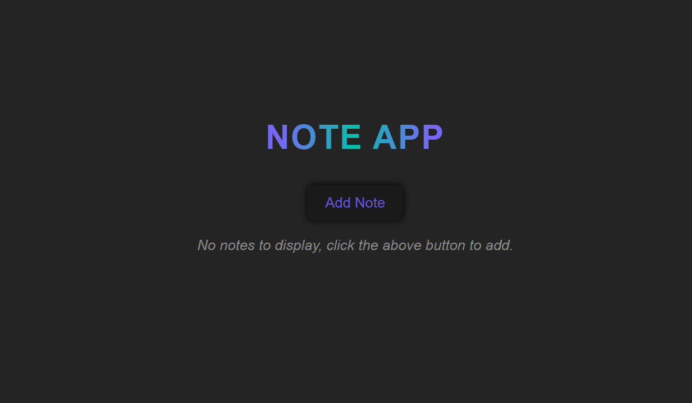
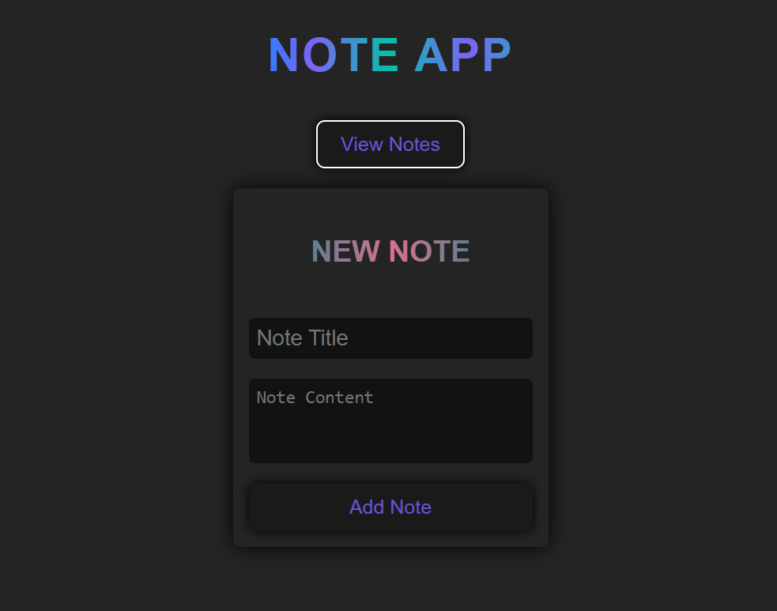
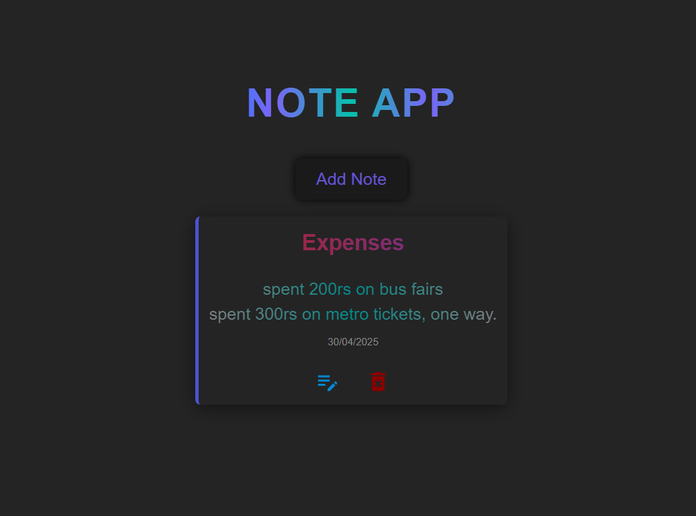

## Why LocalStorage?

- LocalStorage is used here for its simplicity and persistence:
- No server required
- Easy to serialize/deserialize data
- Notes persist even after page reloads
- Suitable for quick prototypes and personal tools

---

## State Management

- React's useState and useEffect manage component state.
- notes array holds all notes.
- A view state (add or list) controls, which screen is shown.
- On note addition, state updates and localStorage are synced.

---

## Styling Approach

- Written in plain CSS (index.css)
- Clean layout with form, list, and navigation styles
- Responsive design using basic Flex/Grid layouts

---

## Error Handling

- Try-catch blocks used in storage.js
- If saving to localStorage fails, an error message is shown in the UI.

---

[Live App On Netlify](https://go-note.netlify.app/)

## Screenshots
### Welcome Page

### Add Note Form


### Notes List


## Getting Started

```bash
git clone https://github.com/N-0-B-O-D-Y/Go-Notes.git
cd note-app
npm install
npm start
